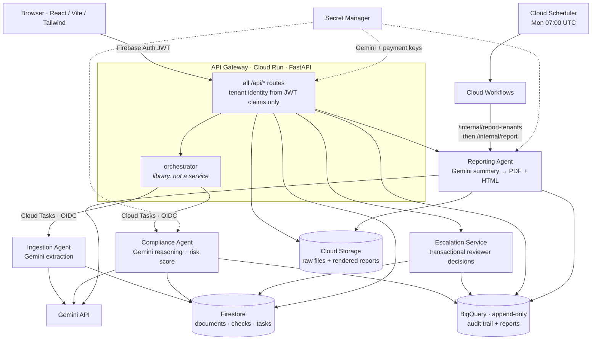
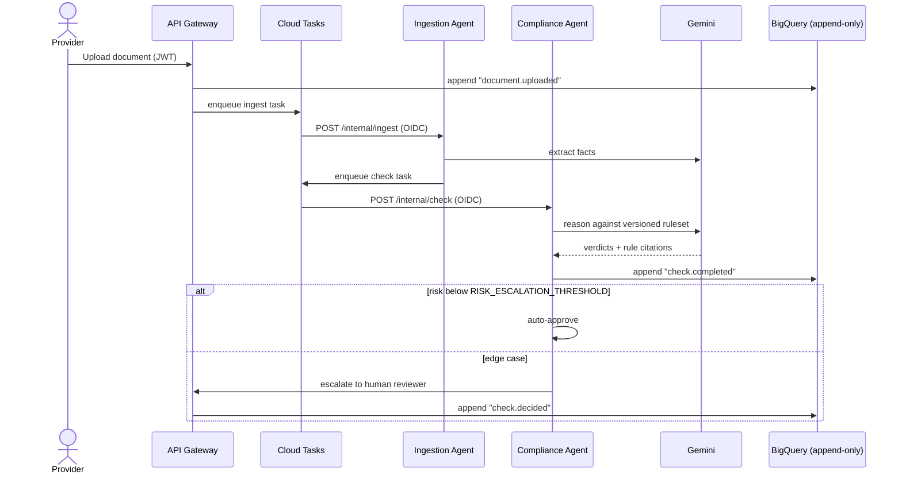
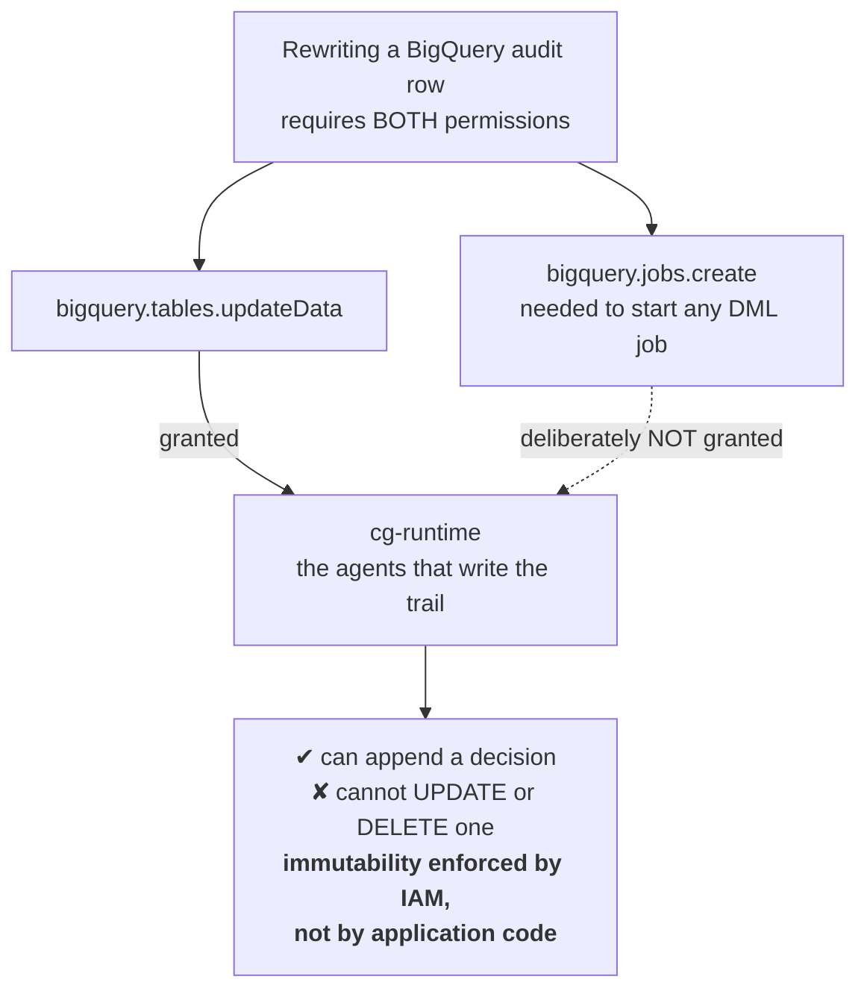

# ComplianceGuardian

**XPRIZE Build with Gemini Hackathon — Aug 17, 2026**

Agentic compliance automation for small businesses. Upload a document, get an instant Gemini-powered risk score with cited rules, auto-approve or escalate to a human reviewer — fully auditable. Repeat for all your contracts, invoices, and policy forms.

---

## Architecture

Five Cloud Run services. `orchestrator/` is a **library imported by the gateway**, not
a sixth deployed service — Cloud Build builds five images and that is the whole set.



### Document lifecycle



---

## Quick start (local)

### Prerequisites

- Python 3.11+
- Node 18+ / npm
- Docker Desktop (for local emulators)
- `gcloud` CLI

### 1. Clone and set up environment

```bash
cd compliance-agent
cp .env.example .env
# Edit .env — at minimum set GEMINI_API_KEY for live Gemini calls
```

### 2. Start local emulators

```bash
docker compose -f docker-compose.emulators.yml up -d
# Firestore :8085 · BigQuery :9050 · GCS :4443
```

### 3. Seed demo data

```bash
python -m venv .venv && .venv/Scripts/activate   # Windows
pip install -r requirements-dev.txt

export GOOGLE_CLOUD_PROJECT=cg-local
export FIRESTORE_EMULATOR_HOST=localhost:8085
export BIGQUERY_EMULATOR_HOST=http://localhost:9050
export STORAGE_EMULATOR_HOST=http://localhost:4443
python scripts/seed.py
```

### 4. Run the API Gateway

```bash
export CG_AUTH_DEV_MODE=1          # dev auth (no Firebase Auth emulator needed)
export CG_DISPATCH_MODE=inline     # run agents in-process
uvicorn api_gateway.main:app --reload --port 8080
# PYTHONPATH must include shared/ + all services/*/
```

Or use the single-command wrapper:
```bash
python scripts/run_gateway_local.py   # sets up paths automatically
```

### 5. Run the dashboard

```bash
cd apps/dashboard
cp .env.example .env.local
# Set VITE_AUTH_MODE=dev  VITE_API_BASE_URL=http://localhost:8080
npm install && npm run dev
# → http://localhost:5173
```

Log in with any tenant + role combination (dev mode). Upload a document, trigger a compliance check, and use a reviewer account to approve or reject escalations.

### 6. Run the end-to-end demos

```bash
# Phase 2 — Gemini extraction + compliance (requires GEMINI_API_KEY)
python scripts/demo_phase2.py doc-ndis-violations

# Phase 3 — RBAC + approve/reject + concurrency proof
python scripts/demo_phase3.py

# Phase 4 — Reporting agent (fixture if no key, real Gemini if key set)
python scripts/demo_phase4.py
```

---

## Environment variables

| Variable | Required | Default | Description |
|---|---|---|---|
| `GOOGLE_CLOUD_PROJECT` | Yes | `cg-local` | GCP project ID |
| `GEMINI_API_KEY` | Phase 2+ | — | Google AI Studio key. Set via `.env` locally; Secret Manager in prod |
| `GEMINI_MODEL` | No | `gemini-2.5-flash` | Model name (stored with every AI call) |
| `FIRESTORE_EMULATOR_HOST` | Local | — | e.g. `localhost:8085` |
| `BIGQUERY_EMULATOR_HOST` | Local | — | e.g. `http://localhost:9050` |
| `STORAGE_EMULATOR_HOST` | Local | — | e.g. `http://localhost:4443` |
| `RISK_ESCALATION_THRESHOLD` | No | `60` | Risk score (0-100) above which checks escalate to a human |
| `CG_AUTH_DEV_MODE` | Local only | `0` | `1` → accept dev bearer tokens (no Firebase Auth emulator) |
| `CG_REQUIRE_EMAIL_VERIFICATION` | No | `0` | `1` → refuse Firebase sessions whose email is unverified (403). Off by default: enabling it retroactively locks out accounts created before verification existed |
| `CG_RL_AUTH_CAPACITY` | No | `5` | Signup burst allowance per client IP |
| `CG_RL_AUTH_REFILL_PER_SEC` | No | `0.0083` | Signup refill rate (1 per 2 min) |
| `CG_RL_EXPENSIVE_CAPACITY` | No | `20` | Burst for endpoints that spend money or call a third party (Gemini, BigQuery, payment providers, Slack, Firebase user creation) |
| `CG_RL_EXPENSIVE_REFILL_PER_SEC` | No | `0.033` | Refill rate for the expensive tier (1 per 30 s) |
| `CG_RL_STANDARD_CAPACITY` | No | `120` | Burst for ordinary authenticated reads/writes |
| `CG_RL_STANDARD_REFILL_PER_SEC` | No | `2.0` | Refill rate for the standard tier |
| `CG_RL_UPLOAD_CAPACITY` | No | `20` | Upload burst per tenant |
| `CG_RL_UPLOAD_REFILL_PER_SEC` | No | `0.5` | Upload refill rate per tenant |
| `CG_RL_BACKOFF_FREE_ATTEMPTS` | No | `3` | Failed auth attempts per account before backoff starts |
| `CG_RL_BACKOFF_BASE_SECONDS` | No | `2.0` | First backoff delay; doubles per subsequent failure |
| `CG_RL_BACKOFF_MAX_SECONDS` | No | `900` | Backoff ceiling — never a permanent lockout |
| `CG_DISPATCH_MODE` | No | `inline` | `inline` = in-process (local); `cloud` = Cloud Tasks (deployed) |
| `CG_CORS_ORIGINS` | No | `http://localhost:5173` | Comma-separated allowed CORS origins |
| `INTERNAL_TASK_TOKEN` | No | — | Shared secret header for internal service-to-service calls. Note the guard is `if expected and token != expected`, so leaving it unset makes the check a no-op — internal routes then rely solely on Cloud Run IAM, which is how the deployed services are actually protected |

### Deployed-only variables

These are set by Terraform on Cloud Run and have no role in local development. They are
listed because **anything the live service needs must be declared in Terraform** — a
value set by hand with `gcloud run services update` is invisible to the configuration
and will be deleted by the next apply.

| Variable | Source | Description |
|---|---|---|
| `CG_PLATFORM_ADMIN_UIDS` | `platform_admin_uids` | Emails/UIDs allowed to reach `/api/platform/*`. Empty means nobody — closed by default, the right failure mode for a cross-tenant surface |
| `CG_SUPPORT_AGENTS` | `support_agents` | Operators who may reply to support tickets. Separate from platform admin on purpose: reading the inbox is not the same as writing to customers as the company |
| `CG_DASHBOARD_BASE_URL` | tfvars | Used to build links in outbound notifications |
| `CG_ENABLE_DOCS` | tfvars | Exposes `/docs`. Off in production |
| `INGESTION_URL` / `COMPLIANCE_URL` | Cloud Run URIs | Targets for Cloud Tasks dispatch |
| `INVOKER_SA` | `cg-runtime` | Identity Cloud Tasks impersonates to invoke internal services |
| `RAZORPAY_KEY_ID` / `_KEY_SECRET` / `_WEBHOOK_SECRET` | Secret Manager | Gated behind `enable_razorpay` |
| `PAYPAL_CLIENT_ID` / `PAYPAL_SECRET` | Secret Manager | Gated behind `enable_paypal` |
| `PAYPAL_LIVE` | `paypal_live` | `1` = `api-m.paypal.com`, `0` = sandbox. Must match the stored credentials — live keys against sandbox 401 on every call |
| `PAYPAL_RETURN_URL` / `PAYPAL_CANCEL_URL` | derived | Where PayPal sends the browser after approval or cancellation |
| `CG_PRICE_<PROVIDER>_<PLAN>` | `payment_prices` | Overrides the compiled-in price, in **minor units** (paise, cents) |
| `RESEND_API_KEY` | Secret Manager | Gated behind `resend_api_key_secret`. Unset today, so support runs in-app and the product never claims to have sent mail it did not |
| `SUPPORT_FROM_EMAIL` | tfvars | From-address for support replies |

> **Secret values resolve at instance startup.** Adding a new secret version does not
> hot-swap a warm instance — force a new revision after rotating a key. And never point
> a `secret_key_ref` at a secret with zero versions: the revision fails to start, which
> takes down the entire gateway rather than the one feature.

---

## Running tests

```bash
# Whole suite (hermetic — no emulators, no Gemini key, no network)
python -m pytest tests -q

# Expected: 536 passed
```

If `pytest` dies during plugin loading with an `eth_typing` / `web3` ImportError,
you are running the interpreter's global pytest rather than the venv's. Use
`.venv/Scripts/python.exe -m pytest` so the project's own environment is used.

---

## Deploying to GCP

### Prerequisites

- A GCP project with billing enabled
- `gcloud auth application-default login`
- Push service images to Artifact Registry (see `infra/terraform/cloudrun.tf` for the registry name)

### Terraform apply

```bash
cd infra/terraform
cp terraform.tfvars.example terraform.tfvars
# Fill it in — several variables have no default and the plan will fail without them
terraform init
terraform plan -out=PLAN && terraform apply PLAN
```

`terraform.tfvars` is gitignored (this repository is public and the values include
operator email addresses), so a fresh checkout has no values. **`project_id`,
`platform_admin_uids`, `enable_razorpay`, `enable_paypal` and `paypal_live` have no
defaults on purpose.** A default that looked safe was the hazard: applying with
`enable_paypal = false` does not fail, it succeeds while stripping the PayPal
credentials off the gateway and silently ending international payments. Cloud Run
replaces its env list wholesale on apply, so that removal needs no instruction — it is
just what applying with defaults does.

Terraform provisions: Firestore, BigQuery (`audit_logs` + `reports`), Cloud Storage
(raw docs + reports), Cloud Tasks queue, 5 Cloud Run services, Artifact Registry,
Cloud Workflows (weekly report) + Cloud Scheduler, Secret Manager (Gemini, Razorpay,
PayPal, Resend), Cloud Monitoring (uptime check + alert policies), and all IAM
including the append-only BigQuery custom roles.

### Before every apply

Cloud Run's env list is replaced, not merged, so diff it by **name** rather than
reading the textual plan — env blocks are positional and inserting one shifts every
later entry, which renders as a wall of bogus renames:

```bash
terraform plan -out=PLAN && terraform show -json PLAN > plan.json
# then compare before/after env keyed by name. A correct additive plan removes nothing.
```

Note that `terraform apply` changes Cloud Run **configuration only** — it never
rebuilds or re-pulls an image. Images are tagged `:latest`, so new code needs an
explicit `gcloud run deploy` to create a revision. A clean apply is not evidence that
new code is live.

### Add the Gemini API key

```bash
echo -n "$GEMINI_API_KEY" | \
  gcloud secrets versions add cg-gemini-api-key \
  --project YOUR_PROJECT_ID --data-file=-
```

### Firebase Auth setup

1. Enable Firebase Auth in the Firebase Console for your project.
2. Create users and set custom claims (`tenant_id`, `role`) via the Admin SDK or a Cloud Function.
3. Set the dashboard's `VITE_AUTH_MODE=firebase` and fill in the Firebase web config in `.env.local`.

---

## Operations

### Health checks

Probe **`/api/healthz`**, never `/healthz`. The bare path is registered in the app but
is answered by a Google frontend 404 before it reaches the container, so a monitor
pointed at it reports a permanent outage that is not real. Every other unknown path
returns FastAPI's own 22-byte `{"detail":"Not Found"}`, which is how you tell the two
apart.

### Monitoring

`infra/terraform/monitoring.tf` provisions an uptime check on the gateway plus two
alert policies — gateway health, and any Cloud Scheduler or Cloud Workflows error —
delivered to `alert_email`.

The scheduler/workflow alert exists for a specific reason. The weekly report was
scheduled, appeared healthy, and had never executed once: Cloud Scheduler was rejected
with `PERMISSION_DENIED` every Monday into a log nobody read. **Leaving `alert_email`
empty creates the policies with no notification channel, which is indistinguishable
from having no monitoring at all.**

### Weekly report

Cloud Scheduler (Monday 07:00 UTC) starts a Cloud Workflows execution which calls the
Reporting Agent directly — `GET /internal/report-tenants` for the recipient list, then
`POST /internal/report` per tenant, each isolated so one failure does not abandon the
run. It deliberately does **not** go through the gateway: `/internal/*` routes do not
exist there, and the gateway is `allUsers`-invokable, so moving one onto it would
publish unauthenticated report generation.

Recipients are **active Pro subscribers only** — a scheduled report is what a
subscription buys, and a `SINGLE` one-time buyer purchased one report, not a recurring
one. With no Pro tenants the run correctly returns `[]`; that is success, not failure.
Scheduled generation never calls `consume_report_entitlement`, because that counter
meters what a customer asks for, not what a cron delivers.

Verify by hand rather than waiting for Monday:

```bash
gcloud scheduler jobs run cg-weekly-report-trigger --location us-central1
gcloud workflows executions list cg-weekly-report --location us-central1 --limit 1
```

IAM changes take a few minutes to propagate. A 403 immediately after an apply is
usually propagation, not a wrong grant — re-test before changing anything.

---

## Rulesets

Versioned YAML under `rulesets/{industry}/{jurisdiction}.yaml`. **16 rulesets, 88
individual rules, 12 jurisdiction profiles.** The live catalogue is authoritative —
`GET /api/rulesets/available` returns exactly what is loadable, so check that rather
than this table if the two ever disagree.

| File | Industry | Jurisdiction | Rules |
|---|---|---|---|
| `healthcare_ndis/au.yaml` | NDIS providers | Australia | 14 |
| `aged_care/au.yaml` | Aged care providers | Australia | 6 |
| `contract_review/generic.yaml` | Commercial contracts | Generic | 6 |
| `bookkeeping/au.yaml` | Supplier invoices | Australia | 5 |
| `corporate_compliance/in.yaml` | Corporate compliance | India | 12 |
| `data_privacy/ae.yaml` | Data privacy (PDPL) | United Arab Emirates |
| `data_privacy/in.yaml` | Data privacy (DPDP Act) | India |
| `data_privacy/us-ca.yaml` | Data privacy (CCPA/CPRA) | California, USA |
| `data_privacy/br.yaml` | Data privacy (LGPD) | Brazil |
| `data_privacy/eu.yaml` | Data privacy (GDPR) | European Union |
| `data_privacy/uk.yaml` | Data privacy (UK GDPR + DPA 2018) | United Kingdom |
| `data_privacy/ca.yaml` | Data privacy (PIPEDA) | Canada |
| `data_privacy/sg.yaml` | Data privacy (PDPA) | Singapore |
| `data_privacy/cn.yaml` | Data privacy (PIPL) | China |
| `data_privacy/za.yaml` | Data privacy (POPIA) | South Africa |
| `data_privacy/au.yaml` | Data privacy (Privacy Act 1988 / NDB scheme) | Australia |

The `data_privacy` rulesets (11 jurisdictions, spanning the Middle East,
Asia, Europe, North America, South America, Africa, and Oceania) are
modeled on real, named laws (cited in each file's header) from public
secondary guidance, not primary legal text — a structural starting point
for a real global compliance product line, not a substitute for local
legal review before real customer use. Where a law itself doesn't set a
fixed statutory deadline (Canada, South Africa), the ruleset says so
explicitly rather than inventing a precise number to look more complete
than the underlying law actually is.

To add a new ruleset: create the YAML (validated against the `RuleSet` Pydantic schema on load), bump `rule_set_version`, redeploy. No code changes needed.

---

## Repo structure

```
compliance-agent/
├── apps/
│   ├── api-gateway/         FastAPI public entry point
│   └── dashboard/           Vite + React + Tailwind + Firebase
├── services/                DEPLOYED unless noted
│   ├── orchestrator/        Task lifecycle + dispatch — LIBRARY, imported by the
│   │                        gateway. Not a Cloud Run service, despite the folder
│   ├── ingestion-agent/     Gemini field extraction
│   ├── compliance-agent/    Gemini risk scoring + rule verdicts
│   ├── reporting-agent/     Gemini executive summaries → PDF + HTML in GCS.
│   │                        Runs as cg-runtime, because it writes
│   └── escalation-service/  Transactional reviewer decisions
├── shared/                  Installed as a wheel into every container. Every
│   │                        package here must appear in shared/pyproject.toml's
│   │                        packages.find include, or the container dies on import
│   ├── analytics/           Trend aggregation for the dashboard
│   ├── api_keys/            Programmatic access tokens, scoped per tenant
│   ├── audit_logger/        Append-only BigQuery writes with retry
│   ├── auth_middleware/     Firebase JWT verification (+ dev mode)
│   ├── gcp_clients/         Emulator/prod factory + Firestore repo
│   ├── gemini_client/       Retry, JSON repair, version tagging
│   ├── notifications/       Slack escalation alerts
│   ├── payments/            Razorpay + PayPal, server-side prices
│   ├── retention/           Scheduled document retention sweep
│   ├── schema_validators/   Pydantic data model (single source of truth)
│   ├── support_notify/      Support ticket notification hooks
│   └── task_dispatch/       Cloud Tasks / inline dispatcher
├── infra/
│   ├── terraform/           All GCP resources, IAM, monitoring
│   └── workflows/           Cloud Workflows YAML
├── rulesets/                16 versioned compliance rule YAML files
├── scripts/                 seed.py + demo_phase2/3/4.py
├── tests/                   536 hermetic tests
└── docker-compose.emulators.yml
```

---

## Security notes

- `tenant_id` is **always** sourced from the verified Firebase JWT claim — never from client request bodies or query parameters.
- The BigQuery `audit_logs` table is **append-only** enforced at IAM level: the runtime service account holds a custom role with `bigquery.tables.updateData` but **without** `bigquery.jobs.create`, so UPDATE/DELETE/MERGE DML is physically impossible regardless of application code.



  `cg-gateway` is the one documented exception — it legitimately needs both audit
  appends and SELECT queries in the same process, so it is **not** provably incapable
  of DML. Keep that list at one identity.

- **Do not grant `cg-reader` append access to fix a 403.** It holds
  `bigquery.jobs.create`, so adding `tables.updateData` would hand it DML over the
  audit trail and destroy the guarantee above. `cg-reader` is currently unused and
  holds no bindings at all; the reporting agent runs as `cg-runtime`, which can append
  without being able to rewrite.
- Cloud Storage uses default Google-managed encryption at rest (documented choice: CMEK adds operational burden with no MVP requirement driving it).
- Secrets (Gemini API key) are stored in Secret Manager; no secrets in code or committed tfvars.
- The upload endpoint is rate-limited per tenant (token bucket, 20 req burst, 0.5 req/s refill).
- Firestore security rules (`infra/firestore.rules`) deny all client writes and scope reads to the authenticated user's tenant.
